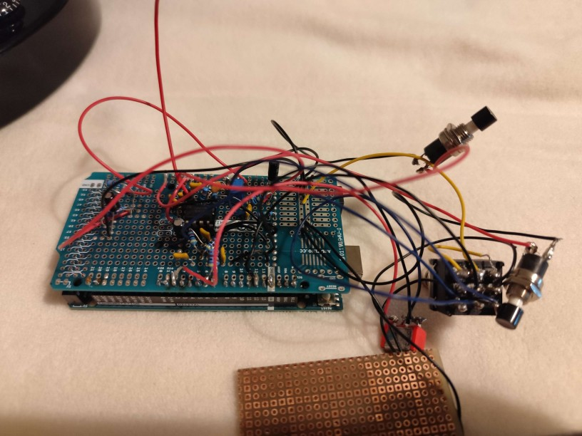
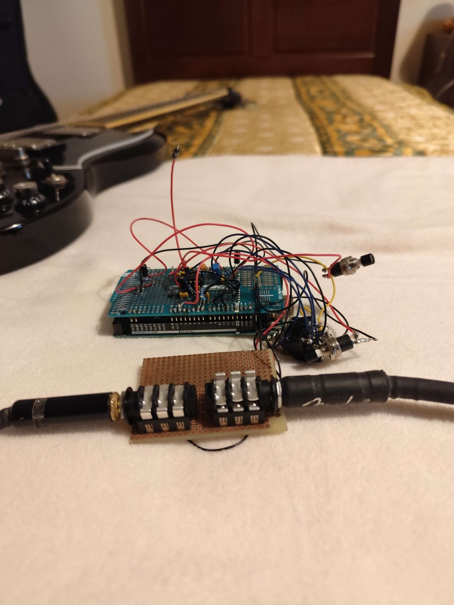
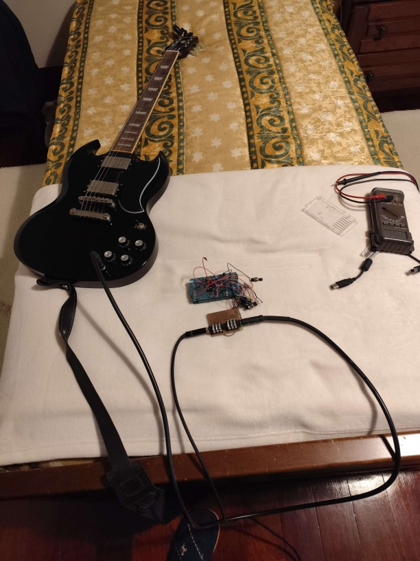
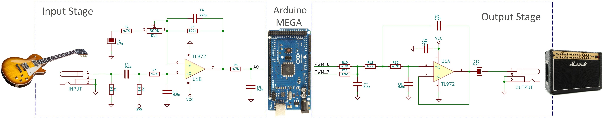

# Arduino Guitar Pedal

Not working as of now, probably a short circuit in the board.

## To do list:
    1. Make the montage more simple.
    2. Try to reduce number of wires
    3. Reweald some of the more sloppy wealds.

